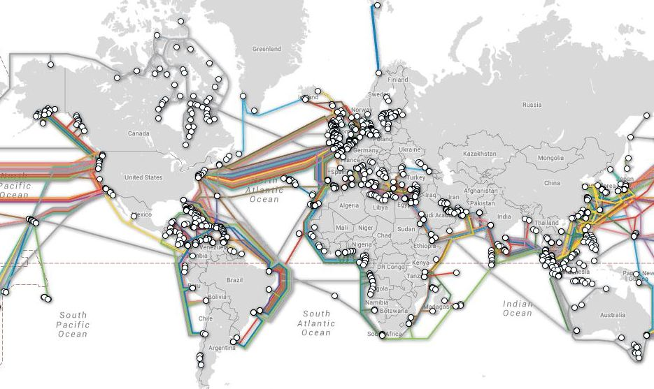
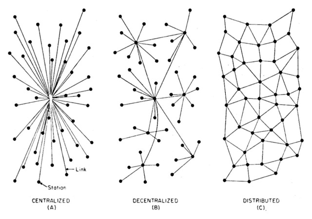

# Internet, reti, protocolli
Prima di tutto una breve introduzione di contesto.

- Come funziona a grandi linee internet?
- Su quali architetture si basa?
- Quali sono le lingue di internet?

## Cos'e' internet?

L’internet è un sistema che permette a diverse reti di collegarsi fra loro, in modo che chi è collegato a una delle reti può comunicare con chiunque sia collegato a una qualsiasi delle altre. In pratica dà a chi si collega la percezione di muoversi in un singolo sistema globale; e il servizio che dà è proprio come se lo fosse.

## Un po' di storia
La prima base, da cui deriva ciò che oggi chiamiamo internet, nacque nel 1969 negli Stati Uniti per opera di scienziati e tecnici che lavoravano per l’ARPA (Advanced Research Project Agency) del Ministero della Difesa degli Stati Uniti. 

Fin dall’inizio era chiaro che le finalità del progetto non erano solo militari. Si costruì un sistema di comunicazione che potesse sopravvivere non solo nel caso di catastrofi ma anche nei momenti di inefficienza, per temporaneo guasto o manutenzione (che erano frequenti nei sistemi informatici del tempo, basati non su reti, ma su singole complesse macchine). 

Si chiamava [ARPA-net](https://it.wikipedia.org/wiki/ARPANET) e all’inizio connetteva pochi grossi calcolatori.

## ARPA-net 1974

## e ora ?

## Architettura di Internet

- la radio FM e' del primo tipo
- la rete gsm e' del secondo tipo (circa)
- Internet e' una rete distribuita

## Protocolli

Internet si basa su una serie di protocolli organizzati in maniera gerarchica a livelli:

- protocolli per la rete fisica (wifi, ethernet, fibra, adsl)
- indirizzamento e instradamento (IP)
- controllo e organizzazione dei dati per la trasmissione (tcp/ip)
- livello applicativo (web, posta, skype...)

il fatto che sia strutturata cosi' implica che ogni strato sia indipendente da quello precedente,
quindi ad esempio che al livello applicativo non interessi se stiamo usando il 3g o il wifi.

## Internet Protocol (IP)
 - Ogni messaggio viene diviso in pacchetti
 - I pacchetti hanno un destinatario
 - Ogni pacchetto puo' prendere una strada diversa
 - Il destinatario di preoccupa di ricostruire il messaggio

## Internet Protocol (IP)
Ma come viene identificato un nodo?

Ha un indirizzo univoco chiamato **indirizzo IP**

## Indirizzo Ip

Indirizzo numerico costituito da 4 bytes, quindi quattro numeri da 0 a 255,
separati da un .

ad esempio: 151.123.2.1

La struttura di questi indirizzi e' definita in modo tale per cui e' facile trovare la
strada per arrivare ad un indirizzo.

(Le poste usano un sistema simile con il cap)

## TCP/IP

Il layer IP si occupa solo di mandare un pacchetto da una sorgente verso una certa destinazione.

Raramente ci interessa mandare solo un pacchetto (che puo' contenere poche informazioni, diciamo circa 1kbyte),
per questo ci vuole un altro protocollo che si preoccupi di dividere i nostri messaggi in pacchetti piu' piccoli
da mandare tramite IP (il layer precedente) e si preoccupi di ricostruire il messaggio in arrivo a destinazione.

## TCP/IP
Quando TCP/IP riceve un flusso di dati, li divide in segmenti e aggiunge altre informazioni al pacchetto, tra cui
il tipo di applicazione che ha prodotto quel flusso di dati, in modo che il destinatario e' in grado di mandare quel
flusso di dati all'applicazione corretta.

## TCP/IP
Inoltre il TCP/IP controlla che i pacchetti arrivino effettivamente a destinazione assicurando
che la comunicazione vada a buon fine.

## Livello applicativo

Tutte le applicazioni che producono dati si collocano qui.
Ci sono moltissimi servizi su Internet, non solo il web (protocollo HTTP):

- la posta (smtp, pop3, imap)
- ftp
- voip
- bittorrent
- dns

La maggior parte di questi protocolli sono standard e aperti, nel senso che chiunque
puo' implementare il protocollo nella sua applicazione (esistono delle eccezioni,
ad esempio skype, niente interoperabilita'!)

## DNS
Il metodo di indirizzamento numerico dell'Internet Protocol, sebbene sia molto efficiente dal punto di vista dei computer, che macinano numeri, è assai complicato da maneggiare per un utente. 

Ricordare le varie sequenze numeriche corrispondenti agli indirizzi dei computer a cui ci si intende connettere può essere molto noioso, come lo sarebbe dover ricordare a memoria tutti i numeri telefonici dei nostri amici e conoscenti.

## DNS
Per ovviare a questi problemi e facilitare l'impiego della rete da parte degli utenti è stato sviluppato un sistema di indirizzamento simbolico, che funziona in modo simile: si chiama Domain Name Service (DNS).

Attraverso il DNS ogni host di Internet può essere dotato di un nome (domain name), composto da stringhe di caratteri. Tali stringhe, a differenza dell'indirizzo numerico, possono essere di lunghezza illimitata. È evidente che per un utente utilizzare dei nomi simbolici è molto più semplice e intuitivo che maneggiare delle inespressive sequenze di numeri. 

## DNS
L'identificativo di un host riassume le varie gerarchie di domini a cui appartiene: ogni sottostringa rappresenta o un dominio, o un sottodominio, o il nome del computer. Ma l'ordine di scrittura è inverso all'ordine gerarchico! Suona complicato, ma non lo è. Vediamo più da vicino il nostro esempio.

La parte di indirizzo più a destra nella stringa indica il dominio più alto della gerarchia, nel nostro caso 'it'. In genere, il livello più alto identifica il paese.

## Client/Server
La maggior parte dei servizi su Internet si basano su una particolare modalita' di interazione
denominata architettura client/server. 

Si indica in questo modo una applicazione, un software che e' costituito da due moduli interagenti ma distinti,
che collaborano tra loro per eseguire un certo compito richiesto dall'utente e che si trovano
su piattaforme hardware diverse.

## Client
Il client e' il programma che costituisce l'interfaccia con l'utente e che si occupa
di richiedere i dati al server e di presentarli.
(nel nostro caso, javascript)

## Server
Il server si occupa del mantenimento dei dati, del reperimento e dell'invio dei dati al client
(nel nostro caso, php)

