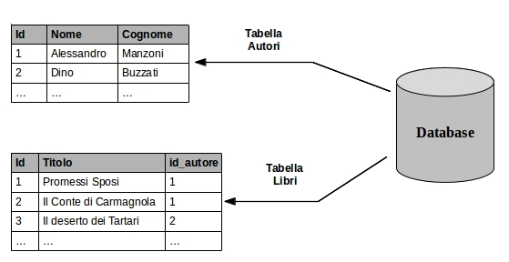
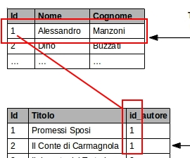

# PHP / Mysql

## Array associativi
<style>
  div.sourceCode {
    font-size: 1.3em;
  }

  .reveal {
    font-size: 27px;
    color: #2d373a;
  }

  .reveal p {
    text-align: left;
  }

  .reveal blockquote {
    text-align: left;
    padding-left: 45px;
    font-size: 1.3em;
    border-left: 5px solid !important;
    background: #eee;
  }

  body {
    background: white;
  }

  .container {
    width: 100%;
    box-sizing: border-box;
  }

  .container textarea {
    width: 50%;
  }

  .container .output {
    width: 50%;
  }

  .reveal pre.sourceCode {
    width: 100%;
    box-shadow: none;
    border: 1px solid #bbb;
    border-left: 5px solid #bbb;
    background: #f5f5f5;
    padding: 5px;
    margin: 0px;
    box-sizing: border-box;
  }

  li > code,
  p  > code {
    border-radius: 6px;
    color: black;
    background: #f4f4f4;
    padding: 0px 4px !important;
  }
</style>
Abbiamo gia' visto molte volte gli array, ma gli array associativi?

```php
<?php
   // dichiarazione di un array associativo
  $utente = array( "nome" => "Mario", "cognome" => "Rossi");
?>
```

Negli array associativi, le chiavi sono esplicite e dichiarate.

## Array associativi

Possiamo fare riferimento ad un elemento dell'array associativo utilizzando la sua chiave:

```php
<?php
  // dichiaro un array di nome $utente
  $utente = array( "nome" => "Mario", "cognome" => "Rossi");

  // modifico il campo nome
  $utente["nome"] = "Antonio";

  // stampo il valore
  echo $utente["nome"];
?>
```

...sia in scrittura, che in lettura.

## Array associativi

Possiamo stampare l'intero contenuto di un array attraverso la funzione `var_dump` (ricordo che per la documentazione delle funzioni e' possibile andare su http://php.net/`nomefunzione`):

```php
<?php
  $utente = array( "nome" => "Mario", "cognome" => "Rossi" );
  var_dump($utente);
?>
```

## Array di array

Molto spesso troverete `array di array`:

```php
<?php
  // creo un array di due utenti
  $utenti = array( array( "nome" => "Mario" ), array( "nome" => "Antonio" ) );

  // stampo il nome del primo utente
  echo $utenti[0]["nome"];
?>
```

## Altro esempio

```php
<?php
  $ricette = array(
    array( "titolo" => "Pane",
           "ingredienti" => array("acqua" => "1l", "farina" => "2kg" ) ),
    array( "titolo" => "Besciamella",
           "ingredienti" => array( "latte" => "1l", "burro" => "200g", "noce moscata" => "qb" ))
  );

  // per sapere quanto burro serve per fare la besciamella:
  echo $ricette[1]["ingredienti"]["burro"];

  // per fare la lista degli ingredienti della besciamella:
  $ingredienti = $ricette[1]["ingredienti"];
  var_dump($ingredienti);
?>
```


## Funzioni sugli array

Gli array hanno veramente [tante funzioni associate](http://php.net/manual/it/ref.array.php), guarderemo le piu' importanti:

- Trovare le chiavi di un array associativo con [array_keys](http://php.net/manual/it/function.array-keys.php)
  (esercizio, nell'esempio di prima stampare tutti gli ingredienti e solo quelli del pane in una lista html)
- Contare quanti elementi sono presenti in un array con [count](http://php.net/manual/it/function.count.php)
  (quanti ingredienti servono per fare la besciamella?)
- Controllare se una chiave esiste in un array con [array_key_exists](http://php.net/manual/it/function.array-key-exists.php)
  (serve l'acqua per fare la besciamella?)
- Controlla se un valore esiste in un array con [in_array](http://php.net/manual/it/function.in-array.php)
  (abbiamo la ricetta del Pane tra le nostre ricette?)
- Ordina un array [ksort](http://php.net/manual/it/function.ksort.php)
  (mostra la lista degli ingredienti della Besciamella in ordine alfabetico)

## Cicli su array associativi
In php esiste una struttura di controllo apposita per ciclare gli array associativi, il **foreach**:

```php
<?php
  $ingredienti = array(
    "latte" => "1l",
    "burro" => "200g", 
    "noce moscata" => "qb" );

  foreach ($ingredienti as $ingrediente => $quantita) {
    echo "<td>$ingrediente</td><td>$quantita</td>";
  }
?>
```

## Esercizio
Provare a strutturare un array associativo di libri di narrativa contenenti le informazioni sull'autore, il titolo e l'anno di pubblicazione.

## Intro Mysql/RDBMS
Dove salvare le infomazioni che i nostri siti devono gestire?
Le ricette, i post, gli utenti, i libri, etc...

Abbiamo bisogno di un qualcosa che ci permetta di salvare in maniera permanente queste informazioni e che ci permetta di aggiornare, recuperare, filtrare, ordinare queste informazioni a piacimento.

Questo qualcosa e' un **database**.

## Database Relazionali
Un database relazionale e' costituito da tabelle, ognuna delle quali e' formata da righe, identificate da un campo univoco chiamato chiave. 

Le tabelle che compongono un database sono in relazione tra loro:



## Relazioni
Esisono piu' tipi di relazioni:

- uno a molti (ad un autore possono corrispondere piu' libri)
- uno a uno (es. auto aziendali associate ai dipendenti)
- molti a molti (ad un articolo possono essere associati piu' tag e viceversa)



Il campo delle tabelle in relazione viene indicato come `chiave esterna` e `chiave primaria`.

## Operazioni su DB
Le operazioni che possiamo fare su DB sono sostanzialmente quattro:

- Inserimento
- Lettura
- Modifica
- Cancellazione

## Creazione DB

```sql
CREATE DATABASE rossoPomodoro;
USE rossoPomodoro;
```

## Creazione tabelle
```sql
CREATE TABLE Ricette {
  id INT NOT NULL AUTO_INCREMENT,
  titolo VARCHAR(45) NULL,
  descrizione TEXT
};
```